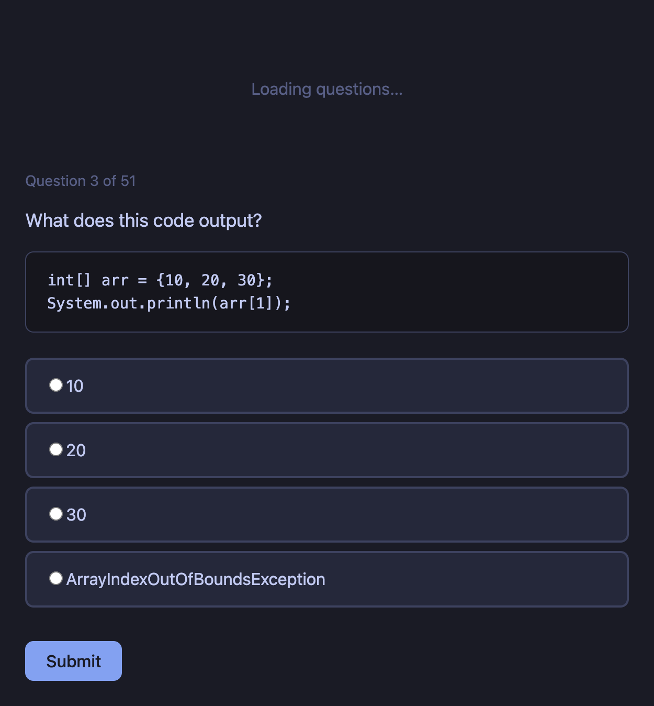

# AP CSA Practice Portal

A static website for students to practice AP Computer Science A multiple choice questions. Runs entirely in the browser—no server required. Designed to host on [GitHub Pages](https://pages.github.com/).

**Live site:** [https://jncomeau-lgtm.github.io/apcsa-practice](https://jncomeau-lgtm.github.io/apcsa-practice)



## Features

- **Browser-only** — No backend; loads `questions.json` via fetch
- **One question at a time** — Clean, focused practice flow
- **Java code blocks** — Questions can include syntax-highlighted code snippets
- **Four answer choices** — Radio buttons for A–D style options
- **Submit** — Check your answer
- **Immediate feedback** — Correct or incorrect, with the right answer highlighted
- **Explanation** — Shown after each answer
- **Next question** — Advance when ready
- **Randomized order** — Question order shuffled each session
- **Score tracking** — Score/total in the header and on the completion screen
- **Dark theme** — Easy on the eyes for long practice sessions

## Quick start

Open `index.html` in a browser. For local development, use a simple HTTP server so `questions.json` loads correctly (e.g. `npx serve .` or `python3 -m http.server 8000`).

## Publishing to GitHub Pages

Follow these steps so students can access the site anytime at a public URL.

### 1. Create a GitHub account (if needed)

Go to [github.com](https://github.com) and sign up, or sign in.

### 2. Create a new repository

1. Click **New** (or the **+** menu → **New repository**).
2. Name the repository (e.g. `apcsa-practice`).
3. Choose **Public**.
4. Do **not** initialize with a README, .gitignore, or license (you already have the files).
5. Click **Create repository**.

### 3. Push your project to GitHub

In a terminal, from your project folder (where `index.html` lives), run:

```bash
# Initialize Git (if this folder isn’t already a repo)
git init

# Add all files
git add index.html style.css app.js questions.json README.md

# First commit
git commit -m "Initial commit: AP CSA Practice Portal"

# Rename the default branch to main (if needed)
git branch -M main

# Add your GitHub repo as the remote (replace YOUR_USERNAME and REPO_NAME with yours)
git remote add origin https://github.com/YOUR_USERNAME/REPO_NAME.git

# Push to GitHub
git push -u origin main
```

When prompted, sign in with your GitHub username and a [personal access token](https://github.com/settings/tokens) (or use SSH if you have it set up).

### 4. Turn on GitHub Pages

1. In the repo on GitHub, go to **Settings**.
2. In the left sidebar, click **Pages** (under “Code and automation” or “Build and deployment”).
3. Under **Source**, choose **Deploy from a branch**.
4. Under **Branch**, select **main** and **/ (root)**.
5. Click **Save**.

### 5. Open your site

After a minute or two, the site will be available at:

**`https://YOUR_USERNAME.github.io/REPO_NAME/`**

Example: if your username is `jdoe` and the repo is `apcsa-practice`, the URL is:

**`https://jdoe.github.io/apcsa-practice/`**

Share this link with students so they can use it anytime.

---

### Updating the site

After you change questions or the site files:

```bash
git add .
git commit -m "Update questions (or describe your change)"
git push
```

GitHub Pages will update automatically; changes usually appear within a few minutes.

### Optional: Custom domain

In **Settings → Pages** you can add a custom domain (e.g. `practice.yourschool.edu`) if your school provides one.
